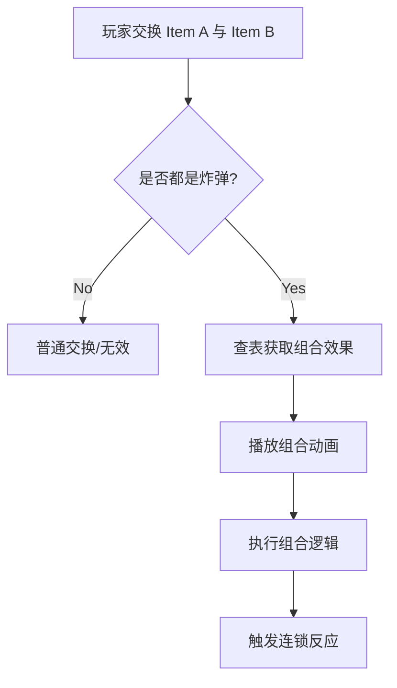
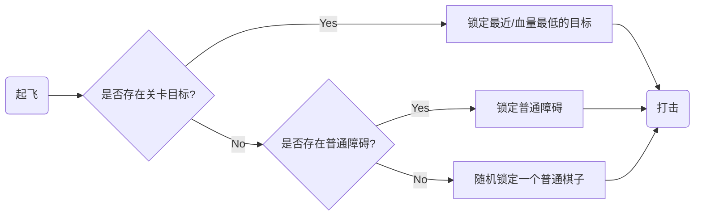

# 核心机制：炸弹爆破与组合 (Bomb Explosion & Combos)

| 文档状态 | 作者 | 日期 | 对应版本 |
| :--- | :--- | :--- | :--- |
| **Draft** | Senior Game Planner | 2026-01-12 | v1.3 |

## 1. 概述 (Overview)

本文档定义了炸弹（Power-ups）被**激活**后的行为逻辑，包括单体爆炸效果与核心的**组合技（Combos）**机制。
设计目标对标 *Royal Match*，强调爽快感、连锁反应与策略性。

### 1.1 核心原则
*   **即时反馈**：点击或交换后必须立即触发视觉反馈（无输入延迟）。
*   **层级破坏**：爆炸应根据障碍物的层级（Layers）进行扣除，通常一次爆炸扣除 1 点耐久。
*   **不消耗步数**：如果是因掉落自动触发的连击，不消耗额外步数；玩家主动交换消耗 1 步。

---

## 2. 触发方式 (Trigger Methods)

| 方式 | 描述 | 逻辑处理 |
| :--- | :--- | :--- |
| **单击 (Single Tap)** | 玩家直接点击炸弹 | **立即**原地触发单体效果。 |
| **交换 (Swap)** | 炸弹与普通棋子交换 | 炸弹在**目标位置**触发单体效果。 |
| **组合交换 (Combo)** | 两个炸弹互相交换 | 触发强力的组合效果（详见第 4 节）。 |
| **诱爆 (Chain)** | 被其他爆炸波及 | 立即触发单体效果（此时无组合技判定）。 |

> **⚠️ 交互警告**: 采用“单击引爆”机制意味着**无法通过点击两个格子进行交换**。
> 玩家必须使用**拖拽 (Drag)** 来移动/交换炸弹。如果玩家点击炸弹并松开（未发生拖拽），将被视为引爆操作。

---

## 3. 单体爆炸逻辑 (Single Bomb Logic)

定义单个炸弹的基础威力。

### 3.1 🚀 火箭 (Rocket)
*   **对应枚举**: `BombType.Horizontal`, `BombType.Vertical`
*   **效果**: 清除整行或整列。
*   **穿透性**: 穿透所有普通障碍物；部分强固障碍物（如保险箱，暂未实现，保留扩展能力即可）可能仅受损而不被穿透（视具体障碍物设计而定）。

### 3.2 💣 TNT炸弹 (TNT)
*   **对应枚举**: `BombType.Area` (Legacy: `Square5x5`)
*   **范围**: **Radius 2 (约 5x5)**。
    *   具体形状：以中心为原点，大小为5X5
*   **伤害**: 区域内所有目标受到 1 点伤害。

### 3.3 🛸 螺旋桨 (Propeller / UFO)
*   **对应枚举**: `BombType.Ufo`
*   **机制**:
    1.  **起飞**: 消除自身周围 **十字** 区域。
    2.  **寻敌**: 自动飞行寻找全场“最有价值”的目标。
        *   *优先级*: 关卡目标 (Objective) > 必须消除的障碍 > 随机普通棋子。不需要实现的太复杂，后续会单独完善机制。
    3.  **打击**: 命中目标后，对目标及其相邻格（十字形）造成 1 点伤害。

### 3.4 🌈 彩虹球 (Light Ball)
*   **对应枚举**: `BombType.Color`
*   **效果**: 
    *   **点击**: 随机清除场上一种颜色的所有普通棋子。
    *   **交换**: 必须与普通色块交换，清除全场所有该颜色的棋子。

---

## 4. 组合技机制 (Combo Mechanics)

这是 Match-3 游戏爽快感的核心来源。当两个炸弹被**直接交换**时触发。

### 组合效果矩阵

| 组合类型 | 视觉描述 | 逻辑效果 |
| :--- | :--- | :--- |
| **🚀 + 🚀** | 十字斩 | 以交换点为中心，清除 **1 行 + 1 列**。 |
| **🚀 + 💣** | 巨型十字斩 | 以交换点为中心，清除 **3 行 + 3 列**（宽幅打击）。 |
| **💣 + 💣** | 核爆 | 以交换点为中心，触发 **9x9** 的超大范围爆炸。 |
| **🚀 + 🛸** | 运载火箭 | 螺旋桨把火箭带到“最优目标”处，**并在该处变为火箭立即引爆**（清除行/列）。 |
| **💣 + 🛸** | 快递炸弹 | 螺旋桨把 TNT 带到“最优目标”处，**并在该处变为 TNT 立即引爆**（Radius 2）。 |
| **🛸 + 🛸** | 编队飞行 | 触发 **3 个** 螺旋桨起飞，分别打击 3 个不同目标。 起飞前原地有两个小十字消除|
| **🌈 + 🚀** | 全屏轰炸 | 将场上**所有**与交换目标同色的棋子变成**火箭**（随机横/竖），然后全部引爆。 |
| **🌈 + 💣** | 全屏爆破 | 将场上**所有**与交换目标同色的棋子变成 **TNT，降级为5X5**，然后全部引爆。 |
| **🌈 + 🛸** | 蜂群出击 | 将场上**所有**与交换目标同色的棋子变成**螺旋桨**，然后全部起飞。 |
| **🌈 + 🌈** | 清屏 | **全屏伤害**。对场上每一个格子造成 1 点伤害（清除所有普通棋子，削弱所有障碍物一层）。 |

---

## 5. 详细逻辑流程 (Detailed Flow)

### 5.1 螺旋桨寻敌逻辑 (Propeller Targeting)
螺旋桨的体验好坏取决于它是否“聪明”。

### 5.2 爆炸传播 (Explosion Propagation)
*   **递归防止**: 炸弹引爆其他炸弹时，被引爆的炸弹**不应**再次触发组合判定，只触发单体效果。
*   **时序**:
    *   Combo 触发 -> 锁定状态（输入屏蔽）。
    *   播放前摇动画（如两个炸弹合并）。
    *   执行逻辑删除。
    *   解除锁定，进行下落填充。

---

## 6. 视觉与音效需求 (Assets Requirements)， 暂时不要实现，后续完善

### 6.1 视觉 (VFX)
*   **Camera Shake**: TNT 和 组合技必须有屏幕震动。
*   **Particles**:
    *   Rocket: 尾焰效果。
    *   TNT: 烟尘与冲击波。
    *   Combo: 必须有全屏变暗的聚焦效果 (Dim Background)。
*   **Layering**: 爆炸特效必须位于棋子层之上，UI 层之下。

### 6.2 音效 (SFX)
*   **Rocket**: 嗖-砰 (高频)。
*   **TNT**: 沉闷的爆炸声 (低频)。
*   **Combo**: 特殊的激昂音效，带有回响。

---

## 7. 边缘情况 (Edge Cases)

*   **Q: 螺旋桨起飞时，目标被其他消除干掉了怎么办？**
    *   A: 螺旋桨应在飞行途中动态重新寻敌 (Re-target)。
*   **Q: 彩虹球 + 炸弹 导致生成的炸弹太密集？**
    *   A: 允许密集爆炸。这是玩家的高光时刻（High Moment），不要人为限制性能，但要注意分帧处理爆炸逻辑以防卡顿。
*   **Q: 爆炸范围超出棋盘边界？**
    *   A: 简单裁切（Clamp 坐标），只处理有效网格内的格子。
*   **Q: 彩虹球 + 彩虹球 是否清除多层障碍？**
    *   A: 通常只造成 1 层伤害。如果是多层障碍（如 3 层木箱），只变成 2 层。

---

## 8. 设计分析：单击 vs 双击 (Design Analysis)

针对“单击引爆”这一设计变更的深度分析。

### 8.1 方案对比

| 维度 | **单击 (Single Tap)** [当前方案] | **双击 (Double Tap)** [传统方案] |
| :--- | :--- | :--- |
| **节奏感 (Pacing)** | **快**。操作极其流畅，无停顿，适合“爽游”定位。 | **中**。需要微小的停顿来确认操作，略微打断心流。 |
| **误触风险 (Error Rate)** | **高**。容易在尝试拖拽或点击相邻格子时误爆。 | **低**。非常安全，明确的意图确认。 |
| **交互逻辑 (Interaction)** | **强制拖拽交换**。点击即爆炸，无法通过“点A再点B”来交换炸弹。 | **兼容性好**。既可以拖拽交换，也可以点击交换。 |
| **学习成本 (Learnability)** | **低**。符合直觉（点了就反应），但需要适应拖拽交换。 | **中**。玩家可能不知道可以双击，需要教学引导。 |

### 8.2 为什么选择单击？
虽然单击增加了误触风险，但它带来了**极致的爽快感**。
在 Royal Match 等现代消除游戏中，高频的点击反馈让游戏体验更加解压。为了解决交互冲突，我们必须在新手引导中强化 **“拖拽交换，点击使用”** 的概念。

### 8.3 技术实现指标：输入判定 (Technical Specs: Input Handling)
为了最大程度缓解“误触”带来的挫败感，输入层必须严格执行以下判定标准：

| 动作类型 | 判定条件 (Conditions) | 预期行为 (Expected Behavior) |
| :--- | :--- | :--- |
| **Tap (单击)** | `PointerUp` 时，手指位移距离 `< GridCellSize * 0.5` | **触发炸弹** / 选中普通棋子 |
| **Drag (拖拽)** | `PointerMove` 过程中，位移距离 `> GridCellSize * 0.5` | 进入 **DRAG 状态**。此时松手**绝不**触发炸弹，而是尝试交换。 |
| **Diagonal Cancel (斜向取消)** | 拖拽角度位于对角线 (45°, 135°, 225°, 315°) 附近的死区内 (±10°) | 视为**取消操作**。即使位移超过阈值，只要落点在死区内，松手时不触发交换也不触发爆炸，棋子弹回原位。 |
| **Hold (长按)** | 按住不动超过 `2s` | 显示详细信息或取消操作，抬起时不触发。 |

*   **实现要求**:
    *   必须在 `InputSystem` 中维护一个状态机：`Idle -> Pending -> Dragging`。
    *   **动态阈值**: 使用 `GridCellWidth * 0.5` 作为判定阈值。这意味着玩家必须拖动超过半个格子的距离，系统才会判定为“拖拽/交换意图”，否则均视为“单击引爆”。
    *   一旦检测到位移超过阈值，状态立即切换为 `Dragging`，并锁定该状态直到 `PointerUp`。
    *   **斜向死区逻辑**: 在 `PointerUp` 时检测拖拽向量的角度。如果角度命中死区 (e.g., 45°±10°)，则强制覆盖为“取消 (Cancel)”指令。
