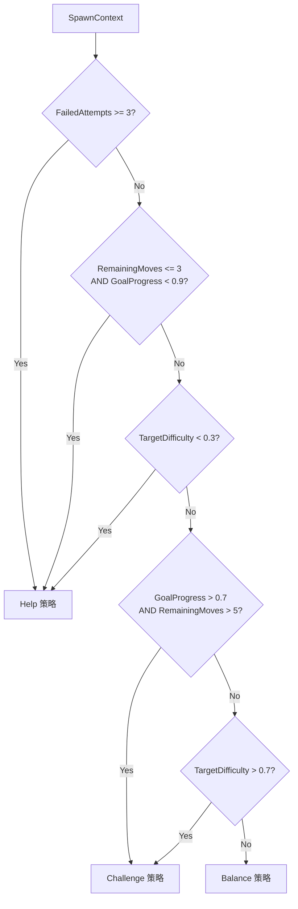

# 核心机制：生成点模型 (Spawn Model)

| 文档状态 | 作者 | 日期 | 对应版本 |
| :--- | :--- | :--- | :--- |
| **Phase 1 Integrated** | AI Assistant | 2026-01-14 | v0.1 (Rule-Based) |

## 1. 概述 (Overview)

生成点模型是控制 Match-3 游戏难度的核心系统。当棋盘顶部需要生成新方块时，该模型根据当前游戏状态智能决定生成哪种颜色，从而实现动态难度调节 (Dynamic Difficulty Adjustment, DDA)。

### 1.1 设计目标

| 目标 | 描述 |
| :--- | :--- |
| **难度可控** | 通过 `TargetDifficulty` 参数精确控制关卡难度 |
| **玩家体验** | 避免玩家连续失败或过于轻松 |
| **渐进架构** | 支持从规则驱动逐步升级到 AI 模型 |
| **向后兼容** | 通过适配器兼容现有 `ITileGenerator` 接口 |

### 1.2 架构概览

```
┌─────────────────────────────────────────────────────────────┐
│                    Spawn Model Architecture                  │
├─────────────────────────────────────────────────────────────┤
│                                                             │
│   Phase 1 (Current)     Phase 2 (Future)    Phase 3 (Future)│
│   ┌─────────────────┐   ┌──────────────┐   ┌──────────────┐ │
│   │ RuleBasedModel  │   │ HybridModel  │   │  RL Model    │ │
│   │ - 规则驱动      │   │ - 规则+统计  │   │ - 强化学习   │ │
│   │ - 即时响应      │   │ - 历史分析   │   │ - 自适应     │ │
│   └────────┬────────┘   └──────┬───────┘   └──────┬───────┘ │
│            │                   │                  │         │
│            └───────────────────┼──────────────────┘         │
│                                ▼                            │
│                    ┌───────────────────────┐                │
│                    │     ISpawnModel       │                │
│                    │  Predict(state, ctx)  │                │
│                    └───────────────────────┘                │
│                                                             │
└─────────────────────────────────────────────────────────────┘
```

---

## 2. 核心接口 (Core Interfaces)

### 2.1 ISpawnModel

生成点模型的统一接口，所有实现（规则/ML/RL）都必须实现此接口。

```csharp
public interface ISpawnModel
{
    TileType Predict(ref GameState state, int spawnX, in SpawnContext context);
}
```

| 参数 | 类型 | 描述 |
| :--- | :--- | :--- |
| `state` | `ref GameState` | 当前棋盘状态（只读） |
| `spawnX` | `int` | 生成点的 X 坐标（列） |
| `context` | `in SpawnContext` | 难度和进度上下文 |

### 2.2 SpawnContext

包含影响生成决策的上下文信息。

```csharp
public struct SpawnContext
{
    public float TargetDifficulty;  // 目标难度 (0.0=简单, 1.0=困难)
    public int RemainingMoves;      // 剩余步数
    public float GoalProgress;      // 目标完成度 (0.0~1.0)
    public int FailedAttempts;      // 连续失败次数
    public bool InFlowState;        // 是否处于心流状态 (Phase 2 预留)
}
```

> **注意**: `InFlowState` 字段在 Phase 1 中未使用，预留给 Phase 2 的更复杂策略。

---

## 3. Phase 1: 规则驱动模型 (Rule-Based Model)

### 3.1 策略选择逻辑



### 3.2 多样性守卫 (Diversity Guard)

在任何策略执行之前，系统会先检查棋盘颜色分布。当某种颜色的占比超过其公平份额的 2 倍时（例如 6 种颜色时阈值为 33.3%），强制生成最稀缺的颜色。

```
判定公式: maxCount * colorCount > totalTiles * 2
门槛条件: totalTiles >= colorCount （棋子太少时不触发）
```

这是一个全局安全网，防止任何策略（Help/Challenge/Balance）的正反馈导致颜色收敛。守卫只在颜色失衡严重时介入，正常情况下不影响策略行为。

### 3.3 三种生成策略

| 策略 | 触发条件 | 行为 |
| :--- | :--- | :--- |
| **Help** | 失败≥3次 / 最后几步 / 低难度(<0.3) | 生成能形成消除的颜色 |
| **Challenge** | 高难度(>0.7) / 玩家进展顺利 | 避免生成能消除的颜色 |
| **Balance** | 中等难度(0.3~0.7) | 平衡各颜色分布（稀有色权重高） |

> **注意**: 代码中还定义了 `Neutral` 策略（纯随机），但当前实现中默认使用 `Balance`，`Neutral` 仅作为 switch 的兜底分支。

### 3.4 Help 策略详解

当玩家需要帮助时，系统会：

1. **预判掉落位置**：计算方块落到哪个 Y 坐标
2. **检测可消除颜色**：找出能形成 3 连的颜色
3. **优先创建消除**：生成能立即消除的颜色
4. **次选近消除**：生成能形成 2 连的颜色（为后续消除铺垫）

```csharp
private TileType SpawnHelpful(ref GameState state, int spawnX, int colorCount)
{
    // 1. 找出能创建消除的颜色
    Span<bool> wouldMatch = stackalloc bool[6];
    BoardAnalyzer.FindMatchingColors(ref state, spawnX, wouldMatch);

    // 2. 优先生成能消除的
    for (int i = 0; i < colorCount; i++)
        if (wouldMatch[i]) return Colors[i];

    // 3. 其次生成能形成近消除的（恰好 2 连）
    int targetY = BoardAnalyzer.SimulateDropTarget(ref state, spawnX);
    for (int i = 0; i < colorCount; i++)
        if (BoardAnalyzer.WouldCreateNearMatch(ref state, spawnX, targetY, Colors[i]))
            return Colors[i];

    // 4. 兜底：随机
    return SpawnRandom(ref state, colorCount);
}
```

### 3.5 Challenge 策略详解

当需要增加挑战时，系统会：

1. **找出不会消除的颜色**
2. **优先生成最稀缺的非匹配颜色**（增加颜色种类，降低消除概率）
3. **避免任何能消除的颜色**

```csharp
private TileType SpawnChallenging(ref GameState state, int spawnX, int colorCount)
{
    Span<bool> wouldNotMatch = stackalloc bool[6];
    BoardAnalyzer.FindNonMatchingColors(ref state, spawnX, wouldNotMatch);

    // 优先生成最稀缺的非匹配颜色（增加挑战但不会导致颜色收敛）
    var rareColor = BoardAnalyzer.FindRarestColor(ref state, colorCount);
    int rareIndex = BoardAnalyzer.GetColorIndex(rareColor);

    if (rareIndex >= 0 && rareIndex < colorCount && wouldNotMatch[rareIndex])
        return rareColor;

    // 其他不会消除的颜色
    // ...（随机选择非匹配颜色，兜底为纯随机）
}
```

> **历史变更**：早期版本使用 `FindMostCommonColor`（优先生成最多的颜色制造拥堵），但该设计存在正反馈失控问题——最多的颜色越来越多，最终导致全盘收敛为单一颜色。已改为 `FindRarestColor`，将正反馈反转为负反馈。

### 3.6 Balance 策略详解

平衡各颜色分布，使棋盘颜色更均匀：

```csharp
private TileType SpawnBalanced(ref GameState state, int spawnX, int colorCount)
{
    // 统计各颜色数量
    Span<int> counts = stackalloc int[6];
    BoardAnalyzer.GetColorDistribution(ref state, counts);

    // 权重 = 100 / (count + 1)，稀有色权重更高
    Span<int> weights = stackalloc int[6];
    int totalWeight = 0;

    for (int i = 0; i < colorCount; i++)
    {
        weights[i] = 100 / (counts[i] + 1);
        totalWeight += weights[i];
    }

    // 边界检查：权重为零时退化为随机
    if (totalWeight <= 0)
        return SpawnRandom(ref state, colorCount);

    // 加权随机选择
    var rng = _rng ?? state.Random;
    int roll = rng.Next(0, totalWeight);
    int cumulative = 0;

    for (int i = 0; i < colorCount; i++)
    {
        cumulative += weights[i];
        if (roll < cumulative) return Colors[i];
    }

    return Colors[0];
}
```

---

## 4. 案例分析 (Case Studies)

### 案例 A：玩家挣扎场景

**情境**：玩家在同一关卡失败了 3 次，剩余 10 步，目标完成度 40%。

```
SpawnContext:
  FailedAttempts = 3  ← 触发 Help
  RemainingMoves = 10
  GoalProgress = 0.4
  TargetDifficulty = 0.5

棋盘状态 (列 2 需要生成):
  Col:  0   1   2   3   4
       [R] [R] [ ] [B] [G]   ← Row 0 (生成点)
       [B] [G] [R] [R] [Y]
       [Y] [B] [G] [B] [R]

分析:
  - 如果生成 Red，会形成 (0,0)-(1,0)-(2,0) 三连 ✓
  - Help 策略会优先选择 Red

结果: 生成 Red，立即触发消除，帮助玩家
```

### 案例 B：玩家顺利场景

**情境**：玩家进展顺利，目标完成度 80%，还剩 8 步。

```
SpawnContext:
  FailedAttempts = 0
  RemainingMoves = 8
  GoalProgress = 0.8  ← 触发 Challenge (>0.7 且 moves>5)
  TargetDifficulty = 0.5

棋盘状态 (列 2 需要生成):
  Col:  0   1   2   3   4
       [R] [R] [ ] [B] [G]
       ...

分析:
  - Red 会形成消除，Challenge 策略会避开
  - 系统查找最稀缺的颜色（假设是 Yellow）
  - 如果 Yellow 不会消除，生成 Yellow

结果: 生成 Yellow，避免轻松消除，同时分散颜色分布
```

### 案例 C：中等难度场景

**情境**：正常游戏流程，难度 0.5。

```
SpawnContext:
  FailedAttempts = 0
  RemainingMoves = 15
  GoalProgress = 0.5
  TargetDifficulty = 0.5  ← 触发 Balance

棋盘颜色分布:
  Red: 12, Green: 8, Blue: 15, Yellow: 5, Purple: 10, Orange: 14

权重计算:
  Red:    100/(12+1) = 7
  Green:  100/(8+1)  = 11
  Blue:   100/(15+1) = 6
  Yellow: 100/(5+1)  = 16  ← 最高权重
  Purple: 100/(10+1) = 9
  Orange: 100/(14+1) = 6

结果: Yellow 有最高概率被选中，平衡颜色分布
```

---

## 5. 棋盘分析器 (Board Analyzer)

`BoardAnalyzer` 是一个静态工具类，提供棋盘状态分析功能。

### 5.1 核心方法

| 方法 | 用途 | 复杂度 |
| :--- | :--- | :--- |
| `GetColorDistribution` | 统计各颜色数量 | O(W×H) |
| `SimulateDropTarget` | 预判方块落点 Y 坐标 | O(H) |
| `WouldCreateMatch` | 检测是否会形成 3 连 | O(W+H) |
| `WouldCreateNearMatch` | 检测是否会恰好形成 2 连 | O(W+H) |
| `FindMatchingColors` | 找出能消除的颜色 | O(6×(W+H)) |
| `FindNonMatchingColors` | 找出不能消除的颜色 | O(6×(W+H)) |
| `FindRarestColor` | 找最稀有的颜色 | O(W×H) |
| `FindMostCommonColor` | 找最多的颜色 | O(W×H) |
| `CalculateMatchPotential` | 计算棋盘消除潜力 | O(W×H) |

### 5.2 性能优化

所有方法都使用 `Span<T>` 和 `stackalloc` 实现零内存分配：

```csharp
// 示例：颜色分布统计
Span<int> counts = stackalloc int[6];
BoardAnalyzer.GetColorDistribution(ref state, counts);
// counts[0] = Red 数量, counts[1] = Green 数量, ...
```

---

## 6. 适配器 (Adapters)

### 6.1 SpawnModelAdapter

将 `ISpawnModel` 适配为 `ITileGenerator`，用于兼容现有系统。

```csharp
public class SpawnModelAdapter : ITileGenerator
{
    private readonly ISpawnModel _model;
    private SpawnContext _context;

    public SpawnModelAdapter(ISpawnModel model, SpawnContext context) { ... }

    public void SetContext(SpawnContext context) => _context = context;

    public TileType GenerateNonMatchingTile(ref GameState state, int x, int y)
        => _model.Predict(ref state, x, in _context);
}
```

### 6.2 LegacySpawnModel

将旧的 `ITileGenerator` 包装为 `ISpawnModel`，用于渐进式迁移。

```csharp
public class LegacySpawnModel : ISpawnModel
{
    private readonly ITileGenerator _generator;

    public TileType Predict(ref GameState state, int spawnX, in SpawnContext context)
        => _generator.GenerateNonMatchingTile(ref state, spawnX, 0);
}
```

---

## 7. 已知限制 (Known Limitations)

### Phase 1 当前限制

| 限制 | 描述 | 计划解决版本 |
| :--- | :--- | :--- |
| **静态落点预判** | `SimulateDropTarget` 只分析当前静态位置，不考虑正在掉落的方块 | Phase 2 |
| **无连锁预判** | 不预测生成后可能触发的连锁反应 | Phase 2 |
| **InFlowState 未使用** | 心流状态字段预留但未实现 | Phase 2 |
| **无历史分析** | 不记录和分析历史生成序列 | Phase 2 |
| **单点决策** | 每次只决策单个生成点，不考虑多列协同 | Phase 3 |

### 边界情况处理

| 情况 | 处理方式 |
| :--- | :--- |
| `colorCount <= 0` | 返回 `TileType.None` |
| 单色占比超过 2×公平份额 | 多样性守卫介入，强制生成最稀缺颜色 |
| 棋盘上棋子数 < colorCount | 守卫不触发，正常执行策略 |
| 所有颜色都会形成消除 | Challenge 策略退化为随机 |
| `totalWeight <= 0` | Balance 策略退化为随机 |

---

## 8. 集成指南 (Integration Guide)

### 8.1 当前状态 (已集成)

```
RealtimeRefillSystem
       │
       ↓
  ISpawnModel (RuleBasedSpawnModel)       ← 已集成
       │
       ↓
  SpawnContext (from GameState)
       │
       ├── TargetDifficulty  ← 从 LevelConfig 初始化
       ├── RemainingMoves    ← MoveLimit - MoveCount
       ├── GoalProgress      ← TODO: 目标系统
       └── FailedAttempts    ← TODO: 会话跟踪
```

### 8.2 已完成的集成

| 组件 | 改动 |
| :--- | :--- |
| `LevelConfig` | 添加 `TargetDifficulty` 属性 (默认 0.5) |
| `GameState` | 添加 `MoveLimit`, `TargetDifficulty` 字段 |
| `BoardInitializer` | 从 LevelConfig 初始化 GameState 的难度字段 |
| `RealtimeRefillSystem` | 依赖从 `ITileGenerator` 改为 `ISpawnModel` |
| `Match3GameService` | 创建 `RuleBasedSpawnModel` 实例 |
| `EditorConfigPanel` | 添加难度滑块 UI (0% - 100%) |

### 8.3 待集成项

| 项目 | 说明 |
| :--- | :--- |
| `GoalProgress` | 当前硬编码为 0，需要与目标系统集成 |
| `FailedAttempts` | 当前硬编码为 0，需要会话级别跟踪 |

---

## 9. 未来规划 (Future Roadmap)

### Phase 2: 混合模型 (Hybrid Model)

- 结合规则和统计数据
- 分析历史生成序列
- 更精确的掉落预判（考虑正在掉落的方块）
- 连锁反应模拟
- 使用 `InFlowState` 进行心流检测

### Phase 3: 强化学习模型 (RL Model)

- 使用 SAC/PPO 算法训练
- 基于玩家行为数据
- 实现真正的动态难度调节
- 多列协同决策

### 研究参考

- [Efficient Difficulty Level Balancing (SAC vs PPO)](https://www.mdpi.com/2079-9292/12/21/4456)
- [Conditional Level Generation with Avalon](https://arxiv.org/html/2409.06349v2)
- [Personalized DDA with Imitation Learning](https://arxiv.org/html/2408.06818v1)

---

## 10. 文件结构 (File Structure)

```
src/Match3.Core/Systems/Spawning/
├── ISpawnModel.cs          # 核心接口
├── SpawnContext.cs         # 上下文结构
├── BoardAnalyzer.cs        # 棋盘分析工具
├── RuleBasedSpawnModel.cs  # Phase 1 实现
├── SpawnModelAdapter.cs    # ITileGenerator 适配器
└── LegacySpawnModel.cs     # 旧系统包装器

src/Match3.Core.Tests/Systems/Spawning/
├── BoardAnalyzerTests.cs
└── RuleBasedSpawnModelTests.cs
```
