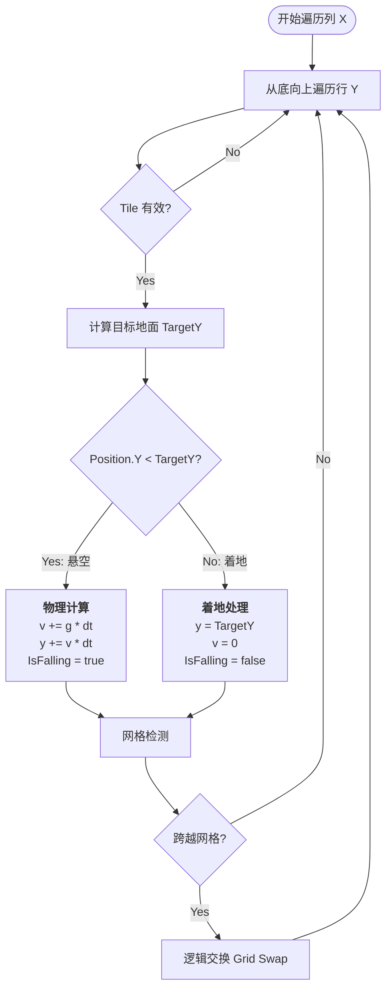

# 核心机制：重力与掉落 (Gravity & Falling)

## 1. 概述
本项目采用 **确定性固定步长物理 (Deterministic Fixed-Step Physics)** 与 **网格逻辑 (Grid Logic)** 相结合的方式。

### 核心原则
1.  **固定时间步长 (Fixed Timestep)**：逻辑更新频率固定（推荐 50Hz，即 `dt = 0.02s`），与渲染帧率解耦。这保证了不同设备上的物理表现完全一致，并支持游戏回放 (Replay)。
2.  **速度限制 (Speed Clamping)**：为了防止穿模 (Tunneling)，最大下落速度受到严格限制，确保单帧位移 `< 0.5` 格。
3.  **真实坐标**：所有棋子 (Tile) 拥有浮点坐标 (`Position`) 和速度 (`Velocity`)，而非简单的插值动画。

这种设计使得掉落过程流畅、自然，且完全可预测。

## 2. 核心组件

| 组件 | 职责 | 所在位置 |
| :--- | :--- | :--- |
| **RealtimeGravitySystem** | 物理模拟核心，计算速度、位移与碰撞 | `Match3.Core.Systems.Physics` |
| **RealtimeRefillSystem** | 生成新棋子，从棋盘顶部“注入” | `Match3.Core.Systems.Generation` |
| **AsyncGameLoopSystem** | 游戏主循环，驱动物理更新 | `Match3.Core.Systems.Core` |
| **Tile (Struct)** | 存储物理状态 (`Position`, `Velocity`, `IsFalling`) | `Match3.Core.Models.Grid` |
| **Match3Config** | 定义物理参数 (重力加速度、最大速度) | `Match3.Core.Config` |

## 3. 物理逻辑流程

### 3.1 状态定义 (`Tile` 结构体)
每个棋子包含以下物理属性：
- **Position (`Vector2`)**: 逻辑坐标。例如 `(3, 4.5)` 表示第 3 列，Y 轴 4.5 处（介于第 4 行和第 5 行之间）。
- **Velocity (`Vector2`)**: 当前速度，主要使用 Y 轴分量。
- **IsFalling (`bool`)**: 标记是否处于下落状态。
- **IsSuspended (`bool`)**: 标记是否被挂起（如消除动画中），挂起时不受重力影响。

### 3.2 重力更新循环 (`RealtimeGravitySystem.Update`)

系统每帧调用 `Update(dt)`，对每一列从 **底部向上** 遍历棋子。



### 3.3 关键算法细节

#### A. 目标计算与逐格下落 (Target Calculation & Sequential Falling)
对于每个棋子，系统会向下扫描寻找最近的"支撑点"：
1.  **静态地面**：棋盘底部或静止的棋子。
2.  **逐格下落机制**：
    *   棋子只有在下方格子的**数据位置**为空时，才会开始下落。
    *   即使下方棋子正在下落中，上方棋子也必须等待下方棋子跨过半格判定线后才能移动。

**示例：垂直三连消除**
```
初始:     C消除后:   B跨过中点:  A开始下落:
A [y=0]   A [y=0]    A [y=0]     A [y=0→1]
B [y=1]   B [y=1→]   空 [y=1]    空 [y=1]
C [y=2]   空 [y=2]   B [y=1.6]   B [y=2]
```
*   C 被消除，y=2 变空
*   B 开始下落，但数据仍在 y=1
*   B 的 Position.Y 跨过 1.5 后，数据从 y=1 移到 y=2，y=1 变空
*   A 检测到 y=1 为空，开始下落

#### B. 空间划分与网格检测 (Spatial Partitioning)
虽然棋子有浮点坐标，但它们必须归属于某个网格槽位 (Slot)。为了解决“物理连续性”与“网格离散性”的矛盾，系统采用了**半格判定**机制。

*   **判定公式**：`VisualRow = Floor(Position.Y + 0.5f)`。即四舍五入判定当前占据哪个格子。
*   **所有权转移**：
    *   当棋子的视觉重心跨过网格线（例如从 3.4 变成 3.6，判定为进入第 4 行）。
    *   **检查**：目标格子（第 4 行）在逻辑上是否为空 (`TileType.None`)。
    *   **执行**：如果为空，立即将棋子数据从 `Grid[x, 3]` 移动到 `Grid[x, 4]`，并清空原位置。
*   **目的**：确保逻辑网格 (`Grid`) 总是反映最新的视觉状态，防止其他系统（如生成器）误判格子为空而产生重叠。

#### C. 生成与填充 (Refill)
`RealtimeRefillSystem` 负责在棋盘顶部生成新棋子。

1.  **检测条件**：
    *   **空顶检测**：如果第 `x` 列的第 0 行 (`Grid[x, 0]`) 为 `TileType.None`（即已被消除或移走）。
    *   **下落检测**：或者 `Grid[x, 0]` 的棋子位置 `Position.Y > Threshold` (例如 0.5)。
2.  **生成动作**：
    *   在逻辑槽位 `(x, 0)` 创建新棋子。
    *   初始物理位置设为 `(x, -1.0)`（屏幕上方不可见区域）。
    *   给予初始下落速度，使其平滑进入画面。

#### D. 斜向滑落 (Diagonal Sliding)
当棋子正下方受阻（如遇到固定障碍）时，系统会尝试让棋子向侧下方滑落。

1.  **判定时机**：在计算 `TargetY` 时，如果发现正下方 (`x, y+1`) 不可通行。
2.  **前置条件 (Prerequisites)**：
    *   **非普通地形**：仅当正下方的阻挡物为 **悬空/障碍物 (Suspended/Obstacle)** 时，才允许触发侧滑。普通棋子堆叠时，上方棋子应保持静止，不可像流体一样滑落。
    *   **垂直优先 (Vertical Priority)**：侧滑前必须检查目标位置的正上方 (`TargetX, TargetY - 1`) 是否有棋子。若有，则视为该位置被垂直下落的棋子“隐式预定”，侧滑请求被拒绝。
3.  **随机性规范**：
    *   当左右均可滑落时，必须使用 **`Match3.Random.IRandom`** 获取随机值进行决策，严禁使用 `System.Random`，以保证回放一致性。
4.  **防抢占机制 (Race Condition Prevention)**：
    *   **即时预定 (Immediate Reservation)**：一旦棋子决定滑向 `(targetX, targetY)`，必须**立即**在 Grid 中将目标格标记为“被预定”（即便物理位置还没到）。
    *   这防止了同一帧内，后续遍历的棋子误判该目标格为空，导致重叠。

#### E. 随机列遍历 (Shuffled Column Update)
为了解决多列汇入一列（漏斗模型）时的“抢占不公”问题：

*   **机制**：每帧更新重力时，使用 `IRandomService` **随机打乱** 列的遍历顺序。
*   **效果**：模拟真实颗粒的随机拥挤行为，避免视觉上的“左侧优先”偏差。

## 4. 参数配置

在 `Match3Config` 中可调整手感：

| 参数 | 说明 | 典型值 |
| :--- | :--- | :--- |
| `GravitySpeed` | 重力加速度 (单位/秒²) | `35.0` |
| `MaxFallSpeed` | 最大下落速度 (防止穿模阈值) | `20.0` |

## 5. 稳定性检测 (Stability Check)

### V1 策略：全局稳定 (Global Stability)
目前 `MatchFinder` 仅在全盘静止时触发消除：
1.  所有棋子的 `IsFalling` 必须为 `false`。
2.  所有棋子位置与网格对齐。

### V2 规划：局部稳定 (Local Stability)
未来将支持“局部消除”，即只要某一块区域静止且构成 Match，无视其他区域是否在动。这将显著提升高频操作下的爽快感。
